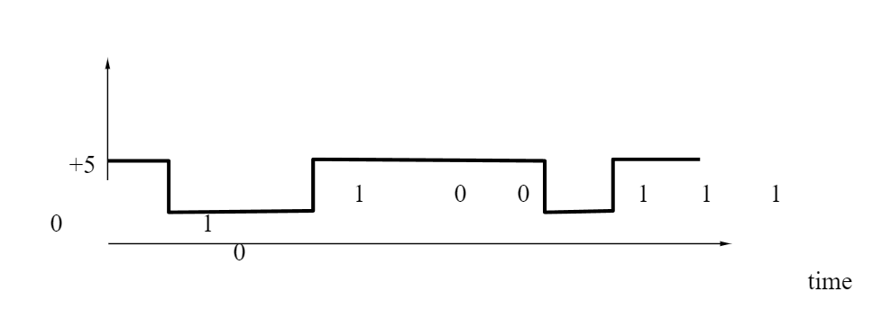

# Chapter 3: Digital Signals
- _Originally created 7 January, 2021 by Maxwell Hauser — Updated 5 October, 2025_
- _Builds upon Chapter 2: Analog Signals._

---

## Background

A signal is a function that conveys information about a phenomenon. Signals can be classified into two main types: **analog** and **digital**.

A **digital signal** is a signal that represents data as a sequence of discrete values. Unlike analog signals, which can take on any value within a range, digital signals have specific levels or states. Digital signals are typically represented using binary code, where each bit can be either a 0 or a 1.

Digital signals are widely used in modern technology due to their robustness against noise and ease of processing.

**Examples of digital signals:**
- Computer data
- Digital audio
- Digital video
- Digital images

### Binary Representation

Modern computers communicate by using digital signals. Digital signals are represented by two voltages: one voltage represents the number 0 in binary and the other voltage represents the number 1 in binary.

- An example of a digital signal is shown in the figure below, where 0 volts represents 0 in binary and +5 volts represents 1:
    > 

 

- 0 or 1 is called a **bit** and 8 bits is called a **byte**.
- A sequence of bits can represent numbers, letters, and other characters. For example, the letter 'A' is represented in binary as 01000001.

---

### Summary

1. Digital signals represent data as discrete values (0 and 1).
2. Digital signals are more robust against noise than analog signals.
3. A bit is the smallest unit of data (0 or 1).
4. A byte consists of 8 bits.
5. Digital signals use voltage levels to represent binary values.
6. Sequences of bits can represent numbers, letters, and characters.

